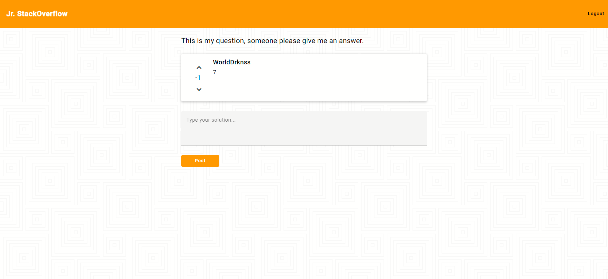

<div id="top"></div>

<!-- PROJECT LOGO -->
<br />
<div align="center">

<a href="https://lab.skynetinc.tech/WorldDrknss/Jr.StackOverflow"><h3 align="center">Jr. StackOverflow</h3></a>

  <p align="center">
    StackOverflow Clone
    <br />
    <br />
    <a href="https://lab.skynetinc.tech/WorldDrknss/Jr.StackOverflow/issues">Report Bug</a>
    ·
    <a href="https://lab.skynetinc.tech/WorldDrknss/Jr.StackOverflow/issues">Request Feature</a>
  </p>
</div>

<!-- ABOUT THE PROJECT -->
# About The Project

[![Product Name Screen Shot][product-screenshot]](https://lab.skynetinc.tech/WorldDrknss/Jr.StackOverflow)

| Up Vote      | Down Vote |
| ----------- | ----------- |
|  |      |

Jr. StackOverflow is a simple clone of the popular Stack Overflow. An online community for developers to learn, share their programming knowledge and build their careers.

* Angular
* Mock API
* Angular Routing
* Angular Reactive Forms
* Angular Re-usable form components
* Angular validation

<p align="right">(<a href="#top">back to top</a>)</p>


### Built With

* [JSON Server](https://www.npmjs.com/package/json-server)
* [Angular](https://angular.io/)

<p align="right">(<a href="#top">back to top</a>)</p>


<!-- GETTING STARTED -->
# Getting Started

To get a local copy up and running follow these simple steps.

**THE DATABASE AND PASSWORDS USED IN THIS APPLICATION ARE NOT SECURE**

### Prerequisites

This is an example of how to list things you need to use the software and how to install them.

* npm
  ```sh
  npm install npm@latest -g
  ```
* Angular
  ```sh
  npm install -g @angular/cli
  ```

### Installation

1. Clone the repo
   ```sh
   git clone https://lab.skynetinc.tech/WorldDrknss/Jr.StackOverflow.git
   ```
2. Install NPM packages
   ```sh
   cd client
   npm install
   ```
3.  Start the development servers
    Start the MOCK database
    ```sh
    json-server --watch mock-api/db.json
    ```
    Start Angular
    ```sh
    ng server
    ```

<p align="right">(<a href="#top">back to top</a>)</p>

<!-- LICENSE -->
# License

Distributed under the MIT License. See `LICENSE` for more information.

<p align="right">(<a href="#top">back to top</a>)</p>


<!-- CONTACT -->
# Contact:

Twitter - [@skynetinctech](https://twitter.com/skynetinctech)

Linkedin - [Charles Showalter](https://linkedin.com/in/charles-showalter)

Instagram - [@skynetinc.tech](https://twitter.com/skynetinc.tech)

Facebook - [@skynetinctech](https://facebook.com/skynetinctech)

Project Link: [https://lab.skynetinc.tech/WorldDrknss/Social.Network/](https://lab.skynetinc.tech/WorldDrknss/Social.Network/)

<p align="right">(<a href="#top">back to top</a>)</p>


<!-- MARKDOWN LINKS & IMAGES -->
<!-- https://www.markdownguide.org/basic-syntax/#reference-style-links -->
[twitter-shield]: https://img.shields.io/twitter/follow/skynetinctech?style=for-the-badge
[twitter-url]: https://twitter.com/skynetinctech
[linkedin-shield]: https://img.shields.io/badge/-LinkedIn-black.svg?style=for-the-badge&logo=linkedin&colorB=555
[linkedin-url]: https://linkedin.com/company/skynetinc
[product-screenshot]: images/home.png